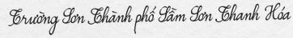
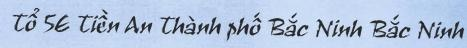
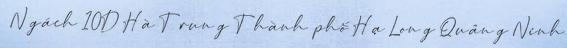
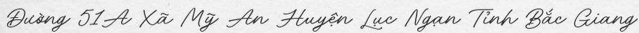

# Vietnamese Handwritten OCR (Top5 Kalapa Challenge 2023)

### Problem Statements
- Problem: Building a lightweight model that can be used in mobile for Vietnamese Handwritten OCR in the domain of Vietnam address

- Input: Raw image with one line text


- Output: the text in input image

- Metric: the custom of edit distance between output with lable

- Requirements: 
    - Model size <= 50mb
    - Inference time <= 2s
    - No pretrained model for OCR task or handwritten dataset

- Some issues with data: 
    - white part at the end of the image
    - short text without linguistic 
    - many colors
    - 2 lines 
    - not show fully text
    - empty images

- Ideas:
    - Choose a very lightweight OCR model: SVTR
    - Train a pretrained model with generated data
    - Finetune on the real dataset

### Prepare data:

```
|___data
|    |___train
|    |    |___images
|    |    |    |___0.jpg
|    |    |    |___...
|    |    |___labels
|    |    |    |___0.txt
|    |    |    |___...
|    |___val
|    |    |___images
|    |    |    |___0.jpg
|    |    |    |___...
|    |    |___labels
|    |    |    |___0.txt
|    |    |    |___...
```

###### Pretrained
- Collect address text:
    - excel file from gov
    - text label from other ocr dataset
    - crawl villages in google

- To generate data, use some handwritten fonts and the text corpus to generate with my repo [OCR-Handwritten-Text-Generator](https://github.com/trinhtuanvubk/handwriten-ocr-kalapa2023)







- Then, apply some augmentation in above repository

- Total: 250k - 350k images

###### Finetuned

- Manual check to crop 2 line image and fix the label

- To crop image to remove the white part at the end, help handle the empty image
```bash
python3 main.py --scenario preprocess \
--raw_data_path "./path/to/raw/data/"
```


- Then, create lmdb data from raw data:
```bash
python3 main.py --scenario create_lmdb_data \
--raw_data_path "./data/OCR/training_data" \
--raw_data_type "folder" \
--data_mode "train" \
--lmdb_data_path "./data/kalapa_lmdb/"
```

- Flag:
    - `raw_data_path`: path to raw data
    - `raw_data_type`: have 3 values:
        - `json`: a dir contains image and a json file with each line contains path to image and text label.
        - `folder`: a dir contains image subdirs and a dir contains subfile .txt label.
        - `other`: the second gen type from my repo.
    - `data_mode`: train data or eval data
    - `lmdb_data_path`: path to output lmdb data


### Trainning
- To run training:
```bash
python3 main.py --scenario train \
--model SVTR \
--lmdb_data_path "./data/kalapa_lmdb/"
--batch_size 16
--num_epoch 1000
```

- To run inference test:
```bash
python3 main.py --scenario infer --image_test_path "path/to/image.jpg"
```

### Postprocess
- To handle some cases that not show fully sigh or very ugly text, or model is wrong -> decode using beamsearch with ngram model
- To build ngram model from the text file generated from the preprocess part, go 
https://github.com/kmario23/KenLM-training

### Export Onxx
- To export model to onnx (optional):
```
python3 export_onnx.py
```

### Submission
- To run infer with a folder:
    - run in batch:
        ```bash
        python3 submission.py
        ```
    - run each image:
        ```bash
        python3 torch_submission.py
        ```
    - run each image with onnx:
        ```bash
        python3 onnx_submission.py
        ```

<!-- ### Todo
- [ ] Implement SAR loss that helps training model with multiple loss
- [ ] Implement LCNET
- [ ] `nnet`: find the way to remove hard code: input shape and output max length
- [ ] Merge config from `dataloader/config.yaml` and `utils/args.py`

### Note
- See `dataloader/config.yaml` to config augmentation, normalization and preprocessing. 
- See `utils/args.py` to modify some config
- Hard code at set max text length to the last layer in  `nnet/modules/rec_head`
- Hard code at `T_max` in cosine lr schedualer
- To build ngram model: https://github.com/kmario23/KenLM-training
- I had a mistake when building dictionary that duplicates 2 symbols. I dont have the resource to retrain model, so comment warning in `python3.10/site-packages/pyctcdecode/alphabet.py` to pass the duplicate check. Please use `utils/vi_dict_fix.txt` to avoid this mistake. -->